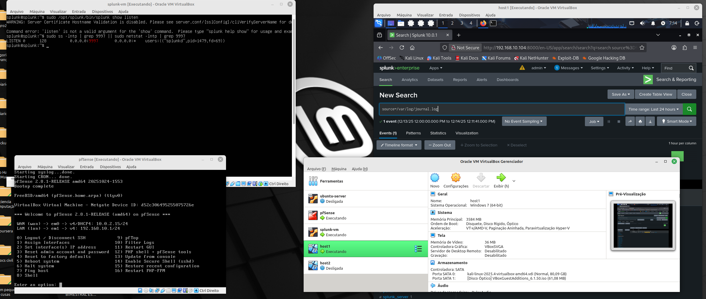
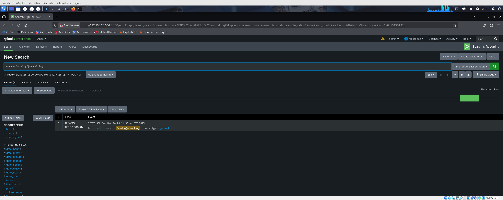
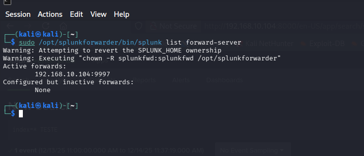

🛡️ SOC Lab — Splunk Enterprise + Kali Linux + pfSense
📌 Overview

This project demonstrates a hands-on Security Operations Center (SOC) laboratory focused on log collection, forwarding, and analysis using Splunk Enterprise and Splunk Universal Forwarder.

The lab simulates a realistic SOC environment, where security-relevant events generated on a Linux host are forwarded to a centralized SIEM for monitoring and investigation.

This lab was built to reinforce Blue Team fundamentals, including:

Log ingestion

Host-based monitoring

SIEM configuration

Event validation

Troubleshooting forwarders and inputs

🧱 Lab Architecture
🔹 Components

Splunk Server

Role: Indexer + Search Head

OS: Linux

IP: 192.168.10.104

Services:

Web UI: http://192.168.10.104:8000

Receiving data on TCP 9997

Kali Linux

Role: Monitored endpoint

Splunk Universal Forwarder installed

System logs forwarded to Splunk

Logs sourced from journalctl

pfSense

Role: Network perimeter firewall

Provides realistic SOC lab topology

Segments and controls traffic between hosts

🧩 Network Topology (Logical)
[Kali Linux]
   |
   |  Logs (TCP 9997)
   v
[Splunk Enterprise Server]
   |
   |  Management & Search
   v
[Analyst via Web UI]

pfSense acts as the gateway/firewall between lab segments.

⚙️ Configuration Summary
Splunk Server

Splunk Enterprise installed and running

Listening on TCP port 9997

Receiving data from Universal Forwarder

Indexing Linux system logs

Kali Linux

Splunk Universal Forwarder installed in /opt/splunkforwarder

Forwarder configured to send data to:

192.168.10.104:9997

Logs collected via:

journalctl

Journal logs exported to:

/var/log/journal.log

📥 Log Ingestion Details

Source: /var/log/journal.log

Sourcetype: journal

Host: kali

Index: main

Example Splunk search used for validation:

index=* host=kali

Successful ingestion confirmed by visible events in Splunk Search & Reporting.

🧪 Validation Evidence

All validation artifacts (screenshots, terminal output, Splunk searches) are stored in:

evidence/

Examples of evidence:

Splunk receiving data on port 9997

Forwarder successfully connected

Indexed events from Kali Linux

Sample search results in Splunk UI

🧠 Skills Demonstrated

SIEM deployment (Splunk Enterprise)

Universal Forwarder configuration

Linux log management (journalctl)

Network segmentation with pfSense

Troubleshooting permissions and ingestion issues

SOC-style validation of log pipelines

🎯 Purpose of This Lab

This lab is part of a Blue Team learning path, focused on building:

Practical SOC experience

SIEM troubleshooting confidence

Portfolio-ready documentation

It mirrors common entry-level SOC tasks such as:

Verifying log ingestion

Investigating missing events

Validating endpoint visibility

🚀 Next Improvements (Planned)

Add pfSense log forwarding to Splunk

Create basic detection searches

Build dashboards for authentication events

Simulate attack scenarios and alerting

Add MITRE ATT&CK mapping

📁 Repository Structure
soc-lab/
├── README.md
├── evidence/
│   ├── splunk-ui-events.png
│   ├── forwarder-status.png
│   └── network-topology.png

👤 Author

Anderson Rocha
Blue Team / SOC Analyst (in training)
Hands-on labs focused on SIEM, Linux, and defensive security
## 📸 Evidence

### Lab Overview

### Splunk Running on Host 1

### Event Received in Splunk

### Kali Connected (UF)

