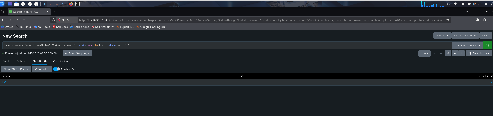
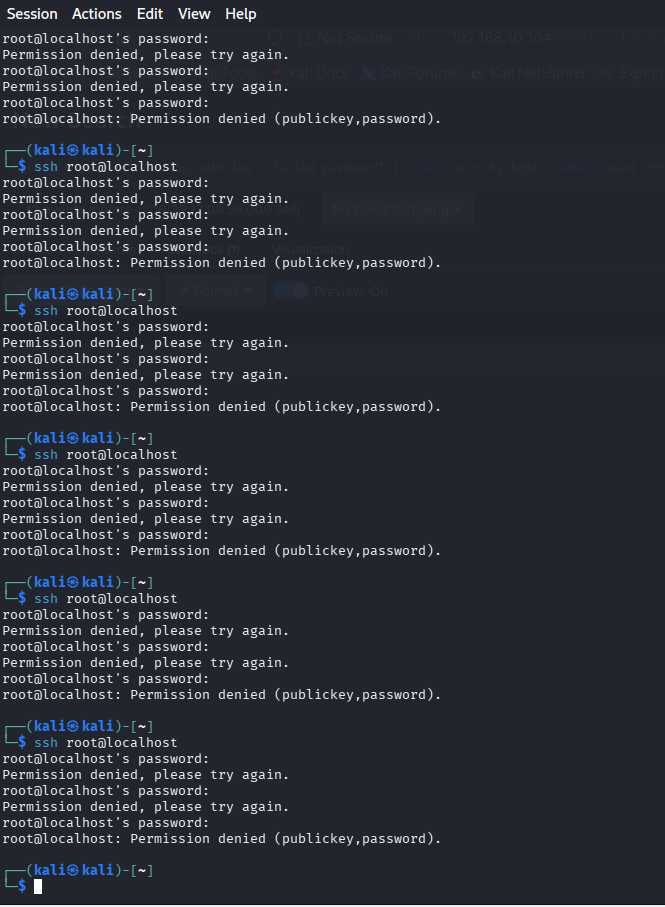

# Lab 02 — Auth Monitoring (SSH Failed Password) com Splunk

## Objetivo
Monitorar e detectar tentativas de autenticação falhas via SSH utilizando logs do Linux (`/var/log/auth.log`) ingeridos no Splunk.

## Ambiente
- Kali Linux
- Splunk Enterprise
- Fonte de dados: `/var/log/auth.log`

## Evidências

### 1) Eventos "Failed password" no Splunk

### 2) Contagem de falhas por host

### 3) Simulação do cenário (tentativas SSH)

